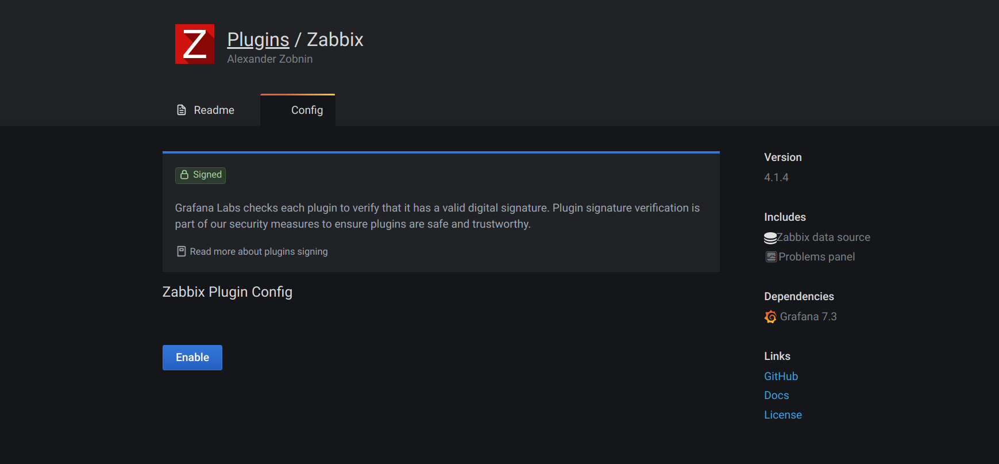
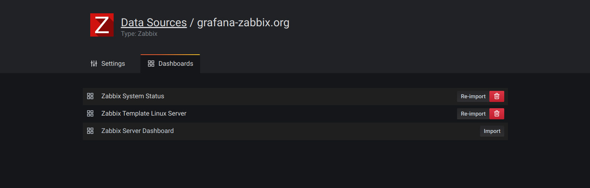

page_title: Grafana-Zabbix Configuration
page_description: Plugin configuration instructions for Grafana-Zabbix.

# Configuration

## Enable plugin

Go to the plugins in Grafana side panel, select _Apps_ tab, then select _Zabbix_, open _Config_
tab and enable plugin.

## Configure Zabbix data source

After enabling plugin you can add Zabbix data source.

To add new Zabbix data source open _Data Sources_ in side panel, click _Add data source_ and select _Zabbix_ from dropdown list.

### HTTP settings

- **URL**: set Zabbix API url (full path with `api_jsonrpc.php`).
- **Access**: Set to `Server (default)`.
- **Http Auth**: configure if you use proxy authentication.
  - **Basic Auth**:
  - **With Credentials**:

### Zabbix API details

- **Username** and **Password**: setup login for access to Zabbix API. Also check user's permissions
    in Zabbix if you cannot get any groups and hosts in Grafana.
- **Trends**: enable if you use Zabbix 3.x or newer. This option is
    strictly recommended for displaying long time periods (more than few days, depending of your item's
    updating interval in Zabbix), because few days of item history contains tons of points. Using trends
    will increase Grafana performance.
  - **After**: time after which trends will be used.
        Best practice is to set this value to your history storage period (7d, 30d, etc). Default is **7d** (7 days).
        You can set the time in Grafana format. Valid time specificators are:
    - **h** - hours
    - **d** - days
    - **M** - months
  - **Range**: Time range width after which trends will be used instead of history.
        It's better to set this value in range of 4 to 7 days to prevent loading large amount of history data.
        Default is 4 days.
- **Cache TTL**: plugin caches some api requests for increasing performance. Set this
    value to desired cache lifetime (this option affect data like items list).
- **Timeout**: Zabbix connection timeout in seconds. Default is 30.

### Direct DB Connection

Direct DB Connection allows plugin to use existing SQL data source for querying history data directly from Zabbix
database. This way usually faster than pulling data from Zabbix API, especially on the wide time ranges, and reduces
amount of data transferred.

Read [how to configure](./direct_db_datasource) SQL data source in Grafana.

- **Enable**: enable Direct DB Connection.
- **Data Source**: Select Data Source for Zabbix history database.
- **Retention Policy** (InfluxDB only): Specify retention policy name for fetching long-term stored data. Grafana will fetch data from this retention policy if query time range suitable for trends query. Leave it blank if only default retention policy used.

#### Supported databases

**MySQL**, **PostgreSQL**, **InfluxDB** are supported as sources of historical data for the plugin.

### Other

- **Disable acknowledges for read-only users**: disable ability to acknowledge problems from Grafana for non-editors.

- **Disable data alignment**: disable time series data alignment. This feature aligns points based on item update interval. For instance, if value collected once per minute, then timestamp of the each point will be set to the start of corresponding minute. This alignment required for proper work of the stacked graphs. If you don't need stacked graphs and want to get exactly the same timestamps as in Zabbix, then you can disable this feature. Also, data alignment can be toggled for each query individually, in the query options.

Then click _Add_ - data source will be added and you can check connection using _Test Connection_ button. This feature can help to find some mistakes like invalid user name or password, wrong api url.

## Import example dashboards

You can import dashboard examples from _Dashboards_ tab in the data source config.

## Note about Browser Cache

After updating plugin, clear browser cache and reload application page. See details
for [Chrome](https://support.google.com/chrome/answer/95582),
[Firefox](https://support.mozilla.org/en-US/kb/how-clear-firefox-cache). You need to clear cache
only, not cookies, history and other data.
