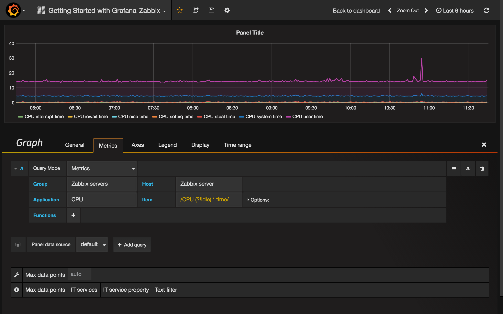
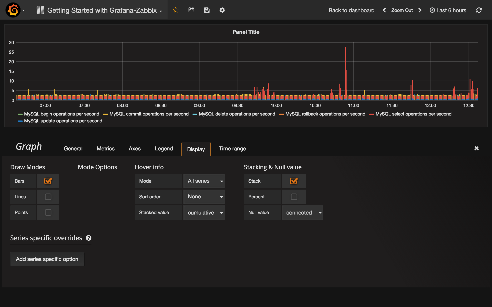
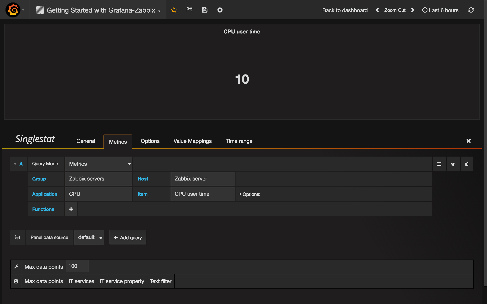
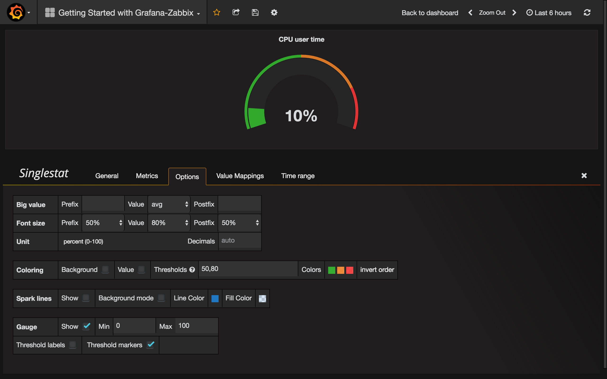
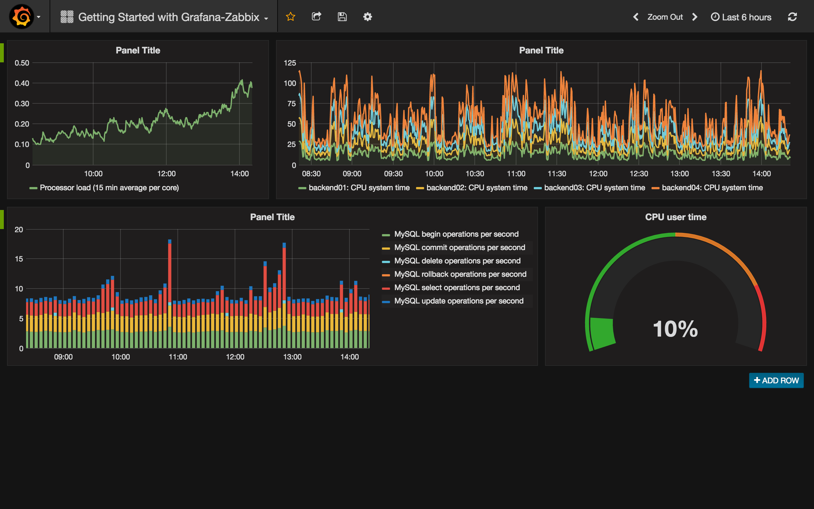

# Getting Started with Grafana-Zabbix
After you [installed and configured](../installation/index.md) Grafana-Zabbix data source let's
create a simple dashboard.

## Simple Graph
Add new Graph panel to dashboard.
Select metrics from dropdown or start to type to filter results


Let's create _15 min avg processor load_ graph. Select Host Group, Host, Application (optional - you can leave it blank) and Item.


## Multiple Items On One Graph
You can build graphs with lots of items using Regular Expressions inside metric field. Grafana uses JavaScript regex implementation. For example, if you need to show CPU time (user, system, iowait, etc) you may create graph using  this regex in Item field:
```js
/CPU (?!idle).* time/
```



Another case to use regex is comparing the same metrics for different hosts. Use `/.*/` regex for showing all metrics or write your own filter. For example, I want to show _CPU system time_ for all hosts which name started with _backend_ from all host groups. I use `/.*/` for Group, `/^backend/` for Host and `CPU system time` for Item.


## Bar Chart
Let's create a graph wich show queries stats for MySQL database. Select Group, Host, Application (_MySQL_ in my case) and Items. I use `/MySQL .* operations/` regex for filtering different types of operations.


To show graph as Bar Chart, go to the **Display** tab, uncheck **Lines** and set **Bars**. Also, enable **Stack** checkbox for showing stacked bars.



But this graph doesn't look good because it contains too many bars. We can fix it by using **Max data points** parameter. Go to the **Metrics** tab and set **Max data points** to 50 for example.


Ok, looks pretty!

## Singlestat and Gauges
Sometimes you may need to show just a big single value for particular metric. Use Grafana's **Singlestat** panel in this case. Let's create panel which shows _CPU user time_ metric.



Suppose that you want to set units as percents and show **Gauge** for this value. Go to the **Options** tab and set units to _percent (0-100)_. Then enable _Show_ option for _Gauge_ and set Min and Max values for your metric (0-100 in our case). Set thresholds if you want to see it on Gauge (`50,80` for example).



Great, looks cool. Read more about Singlestat panel in [Grafana docs](http://docs.grafana.org/reference/singlestat/).

And all together:


