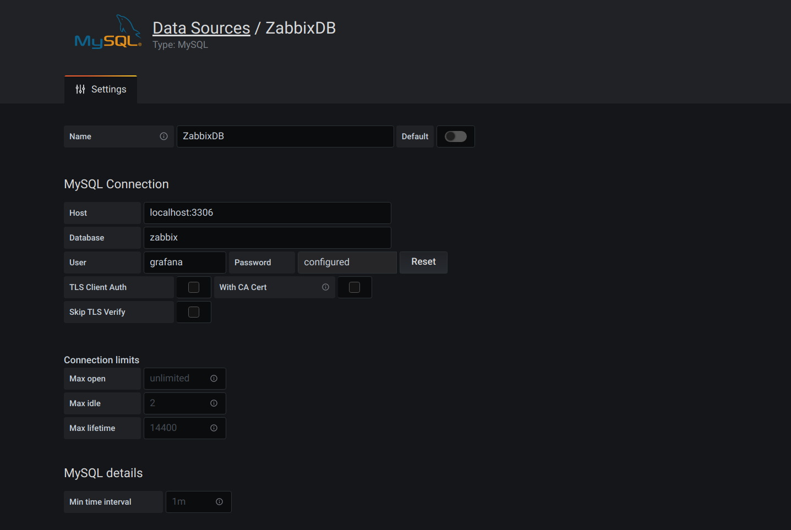

# SQL Data Source Configuration

In order to use _Direct DB Connection_ feature you should configure SQL data source first.



Select _MySQL_ data source type and provide your database host address and port (3306 is default for MySQL). Fill
database name (usually, `zabbix`) and specify credentials.

## Security notes

As you can see in _User Permission_ note, Grafana doesn't restrict any queries to the database. So you should be careful
and create a special user with limited access to Zabbix database. Grafana-Zabbix plugin uses only `SELECT` queries to
`history`, `history_uint`, `trends` and `trends_uint` tables. So it's reasonable to grant only SELECT privileges to
these tables for grafana user. But if you want to use this MySQL data source for querying another data, you can
grant SELECT privileges to entire zabbix database.

Also, all queries are invoked by grafana-server, so you can restrict connection to only grafana host.

```sql
GRANT SELECT ON zabbix.* TO 'grafana'@'grafana-host' identified by 'password';
```
