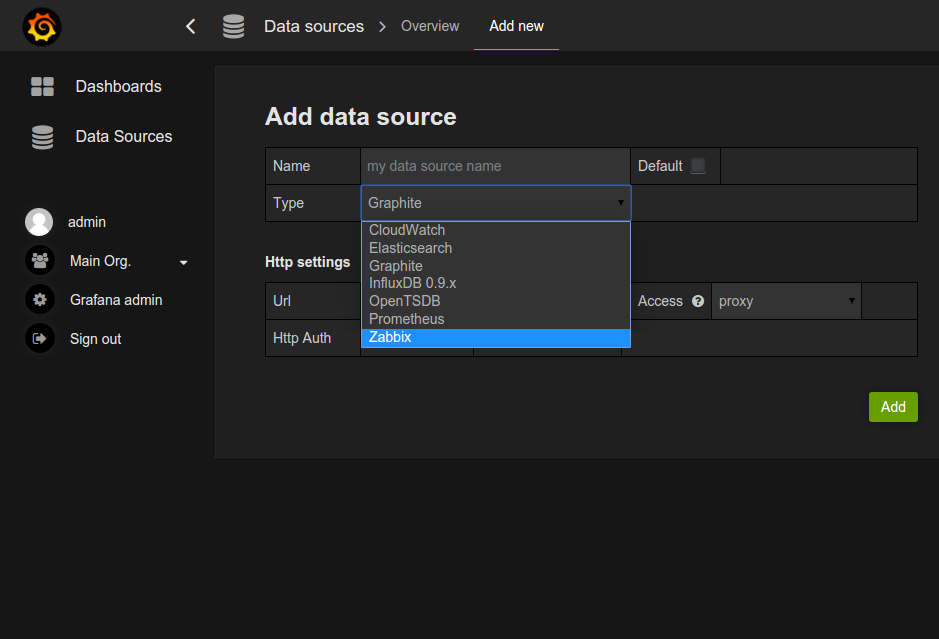
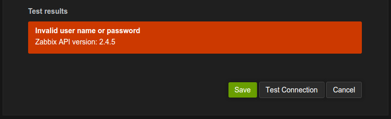

# Configuration

To add new Zabbix data source open _Data Sources_ in side panel, click _Add new_ and select Zabbix
from dropdown list.



Then configure a data source


### Http settings

- **Url**: set Zabbix API url (full path with `api_jsonrpc.php`).
- **Access**: can be either _proxy_ or _direct_.
- **Http Auth**: configure if you use proxy authentication.
    - **Basic Auth**:
    - **With Credentials**:

### Zabbiz API details

- **User** and **Password**: setup login for access to Zabbix API. Also check user's permissions
in Zabbix if you can't get any groups and hosts in Grafana.
- **Trends**: enable if you use patch for trends
support in Zabbix 2.x ([ZBXNEXT-1193](https://support.zabbix.com/browse/ZBXNEXT-1193)). This is
strictly recommended for displaying long time periods (more than few days, depending of your item's
updating interval in Zabbix) because few days of item history contains tons of points. Using trends
can increase Grafana performance.
    - **Use trends from**: time after which trends will be used. Default is **7d** (7 days).
    You can set the time in Grafana format. Valid time specificators are:
        - **h** - hours
        - **d** - days
        - **M** - months
- **Metrics limit**: maximum items number which can be returned by one request. Helps to prevent
Grafana slowdown due wrong request.

Then click _Add_ - datasource will be added and you can check connection using _Test Connection_ button.


This feature can help to find some mistakes like invalid user name or password, wrong api url.




## Note about Zabbix 2.2 or less
Zabbix API (api_jsonrpc.php) before zabbix 2.4 don't allow cross-domain requests (CORS). And you
can get HTTP error 412 (Precondition Failed).
To fix it add this code to api_jsonrpc.php immediately after the copyright:

```php
header('Access-Control-Allow-Origin: *');
header('Access-Control-Allow-Headers: Content-Type');
header('Access-Control-Allow-Methods: POST');
header('Access-Control-Max-Age: 1000');

if ($_SERVER['REQUEST_METHOD'] === 'OPTIONS') {
  return;
}
```
before

```php
require_once dirname(__FILE__).'/include/func.inc.php';
require_once dirname(__FILE__).'/include/classes/core/CHttpRequest.php';
```
[Full fix listing](https://gist.github.com/alexanderzobnin/f2348f318d7a93466a0c).
For more details see zabbix issues [ZBXNEXT-1377](https://support.zabbix.com/browse/ZBXNEXT-1377)
and [ZBX-8459](https://support.zabbix.com/browse/ZBX-8459).

## Note about Browser Cache
After updating plugin, clear browser cache and reload application page. See details
for [Chrome](https://support.google.com/chrome/answer/95582),
[Firefox](https://support.mozilla.org/en-US/kb/how-clear-firefox-cache). You need to clear cache
only, not cookies, history and other data.
